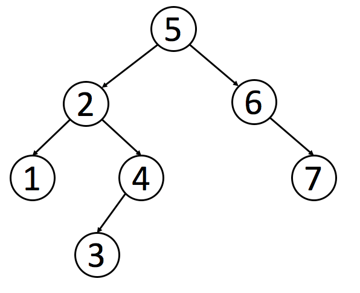
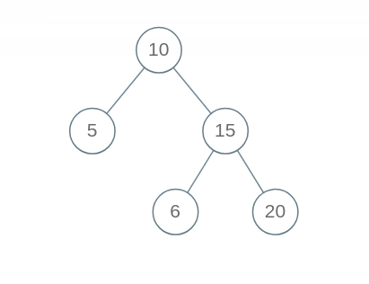
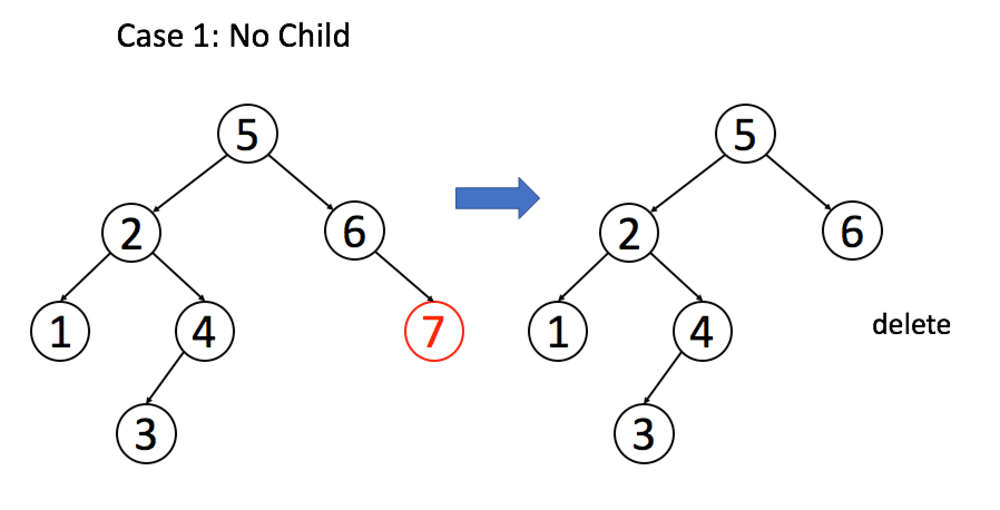
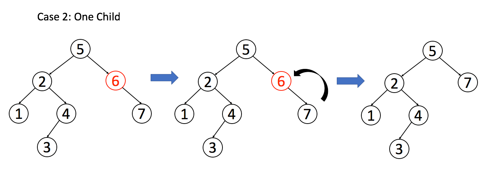
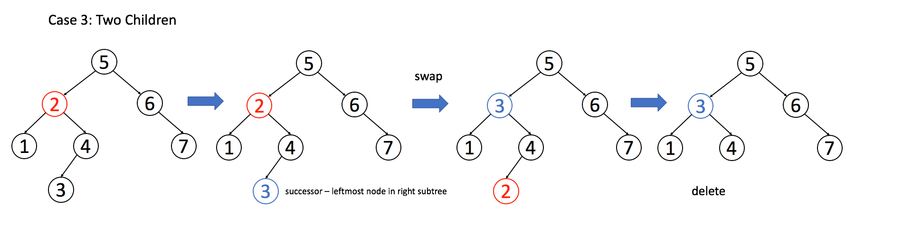

# 二叉搜索树操作集锦


<p align='center'>
<a href="https://github.com/labuladong/fucking-algorithm" target="view_window"></a>
<a href="https://www.zhihu.com/people/labuladong"></a>
<a href="https://i.loli.net/2020/10/10/MhRTyUKfXZOlQYN.jpg"></a>
<a href="https://space.bilibili.com/14089380"></a>
</p>
相关推荐：
  * [特殊数据结构：单调队列](https://labuladong.gitbook.io/algo)
  * [一行代码就能解决的算法题](https://labuladong.gitbook.io/algo)

读完本文，你不仅学会了算法套路，还可以顺便去 LeetCode 上拿下如下题目：

[100.相同的树](https://leetcode-cn.com/problems/same-tree)

[450.删除二叉搜索树中的节点](https://leetcode-cn.com/problems/delete-node-in-a-bst)

[701.二叉搜索树中的插入操作](https://leetcode-cn.com/problems/insert-into-a-binary-search-tree)

[700.二叉搜索树中的搜索](https://leetcode-cn.com/problems/search-in-a-binary-search-tree)

[98.验证二叉搜索树](https://leetcode-cn.com/problems/validate-binary-search-tree)

----

通过之前的文章[框架思维](https://labuladong.gitbook.io/algo)，二叉树的遍历框架应该已经印到你的脑子里了，这篇文章就来实操一下，看看框架思维是怎么灵活运用，秒杀一切二叉树问题的。

二叉树算法的设计的总路线：明确一个节点要做的事情，然后剩下的事抛给框架。

```python
class TreeNode:
    def __init__(self, val=0, left=None, right=None):
        self.val = val
        self.left = left
        self.right = right

def traverse(root):
    # root 需要做什么？在这做。
    # 其他的不用 root 操心，抛给框架
    traverse(root.left)
    traverse(root.right)
```python
举两个简单的例子体会一下这个思路，热热身。

**1. 如何把二叉树所有的节点中的值加一？**

```python
def plus_one(root):
    if root is None:
        return
    root.val += 1
    plus_one(root.left)
    plus_one(root.right)
```python
**2. 如何判断两棵二叉树是否完全相同？**

```python
def is_same_tree(root1, root2):
    if root1 is None and root2 is None:
        return True
    if root1 is None or root2 is None:
        return False
    if root1.val != root2.val:
        return False
    return is_same_tree(root1.left, root2.left) and is_same_tree(root1.right, root2.right)
```python
借助框架，上面这两个例子不难理解吧？如果可以理解，那么所有二叉树算法你都能解决。

二叉搜索树（Binary Search Tree，简称 BST）是一种很常用的的二叉树。它的定义是：一个二叉树中，任意节点的值要大于等于左子树所有节点的值，且要小于等于右边子树的所有节点的值。

如下就是一个符合定义的 BST：




下面实现 BST 的基础操作：判断 BST 的合法性、增、删、查。其中“删”和“判断合法性”略微复杂。

**零、判断 BST 的合法性**

这里是有坑的哦，我们按照刚才的思路，每个节点自己要做的事不就是比较自己和左右孩子吗？看起来应该这样写代码：
```python
def is_valid_bst(root):
    if root is None:
        return True
    if root.left is not None and root.val <= root.left.val:
        return False
    if root.right is not None and root.val >= root.right.val:
        return False
    return is_valid_bst(root.left) and is_valid_bst(root.right)
```python
但是这个算法出现了错误，BST 的每个节点应该要小于右边子树的所有节点，下面这个二叉树显然不是 BST，但是我们的算法会把它判定为 BST。



出现错误，不要慌张，框架没有错，一定是某个细节问题没注意到。我们重新看一下 BST 的定义，root 需要做的不只是和左右子节点比较，而是要整个左子树和右子树所有节点比较。怎么办，鞭长莫及啊！

这种情况，我们可以使用辅助函数，增加函数参数列表，在参数中携带额外信息，请看正确的代码：

```python
def is_valid_bst(root):
    return is_valid_bst_helper(root, None, None)

def is_valid_bst_helper(root, min_node, max_node):
    if root is None:
        return True
    if min_node is not None and root.val <= min_node.val:
        return False
    if max_node is not None and root.val >= max_node.val:
        return False
    return (is_valid_bst_helper(root.left, min_node, root)
            and is_valid_bst_helper(root.right, root, max_node))
```python
## **一、在 BST 中查找一个数是否存在**

根据我们的指导思想，可以这样写代码：

```python
def is_in_bst(root, target):
    if root is None:
        return False
    if root.val == target:
        return True
    return is_in_bst(root.left, target) or is_in_bst(root.right, target)
```python
这样写完全正确，充分证明了你的框架性思维已经养成。现在你可以考虑一点细节问题了：如何充分利用信息，把 BST 这个“左小右大”的特性用上？

很简单，其实不需要递归地搜索两边，类似二分查找思想，根据 target 和 root.val 的大小比较，就能排除一边。我们把上面的思路稍稍改动：

```python
def is_in_bst(root, target):
    if root is None:
        return False
    if root.val == target:
        return True
    if root.val < target:
        return is_in_bst(root.right, target)
    if root.val > target:
        return is_in_bst(root.left, target)
```python
于是，我们对原始框架进行改造，抽象出一套**针对 BST 的遍历框架**：

```python
def bst(root, target):
    if root.val == target:
        pass  # 找到目标，做点什么
    if root.val < target:
        bst(root.right, target)
    if root.val > target:
        bst(root.left, target)
```python
## **二、在 BST 中插入一个数**

对数据结构的操作无非遍历 + 访问，遍历就是“找”，访问就是“改”。具体到这个问题，插入一个数，就是先找到插入位置，然后进行插入操作。

上一个问题，我们总结了 BST 中的遍历框架，就是“找”的问题。直接套框架，加上“改”的操作即可。一旦涉及“改”，函数就要返回 TreeNode 类型，并且对递归调用的返回值进行接收。

```python
def insert_into_bst(root, val):
    if root is None:
        return TreeNode(val)
    if root.val < val:
        root.right = insert_into_bst(root.right, val)
    if root.val > val:
        root.left = insert_into_bst(root.left, val)
    return root
```python
## **三、在 BST 中删除一个数**

这个问题稍微复杂，不过你有框架指导，难不住你。跟插入操作类似，先“找”再“改”，先把框架写出来再说：

```python
def delete_node(root, key):
    if root.val == key:
        pass  # 找到啦，进行删除
    elif root.val > key:
        root.left = delete_node(root.left, key)
    elif root.val < key:
        root.right = delete_node(root.right, key)
    return root
```python
找到目标节点了，比方说是节点 A，如何删除这个节点，这是难点。因为删除节点的同时不能破坏 BST 的性质。有三种情况，用图片来说明。

情况 1：A 恰好是末端节点，两个子节点都为空，那么它可以当场去世了。

图片来自 LeetCode


```python
if root.left is None and root.right is None:
    return None
```python
情况 2：A 只有一个非空子节点，那么它要让这个孩子接替自己的位置。

图片来自 LeetCode


```python
# 排除了情况 1 之后
if root.left is None:
    return root.right
if root.right is None:
    return root.left
```python
情况 3：A 有两个子节点，麻烦了，为了不破坏 BST 的性质，A 必须找到左子树中最大的那个节点，或者右子树中最小的那个节点来接替自己。我们以第二种方式讲解。

图片来自 LeetCode


```python
if root.left is not None and root.right is not None:
    min_node = get_min(root.right)
    root.val = min_node.val
    root.right = delete_node(root.right, min_node.val)
```python
三种情况分析完毕，填入框架，简化一下代码：

```python
def delete_node(root, key):
    if root is None:
        return None
    if root.val == key:
        if root.left is None:
            return root.right
        if root.right is None:
            return root.left
        min_node = get_min(root.right)
        root.val = min_node.val
        root.right = delete_node(root.right, min_node.val)
    elif root.val > key:
        root.left = delete_node(root.left, key)
    elif root.val < key:
        root.right = delete_node(root.right, key)
    return root

def get_min(node):
    while node.left is not None:
        node = node.left
    return node
```python
删除操作就完成了。注意一下，这个删除操作并不完美，因为我们一般不会通过 root.val = minNode.val 修改节点内部的值来交换节点，而是通过一系列略微复杂的链表操作交换 root 和 minNode 两个节点。因为具体应用中，val 域可能会很大，修改起来很耗时，而链表操作无非改一改指针，而不会去碰内部数据。

但这里忽略这个细节，旨在突出 BST 基本操作的共性，以及借助框架逐层细化问题的思维方式。

## **四、最后总结**

通过这篇文章，你学会了如下几个技巧：

1. 二叉树算法设计的总路线：把当前节点要做的事做好，其他的交给递归框架，不用当前节点操心。

2. 如果当前节点会对下面的子节点有整体影响，可以通过辅助函数增长参数列表，借助参数传递信息。

3. 在二叉树框架之上，扩展出一套 BST 遍历框架：
```python
def bst(root, target):
    if root.val == target:
        pass  # 找到目标，做点什么
    if root.val < target:
        bst(root.right, target)
    if root.val > target:
        bst(root.left, target)
```python
4. 掌握了 BST 的基本操作。

---
