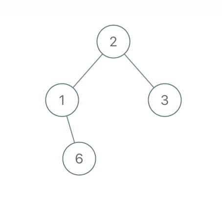
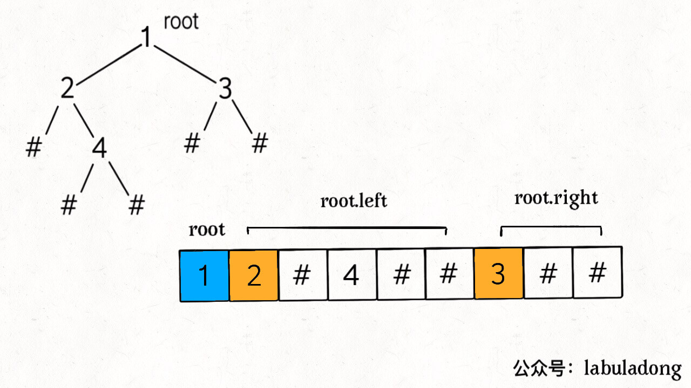
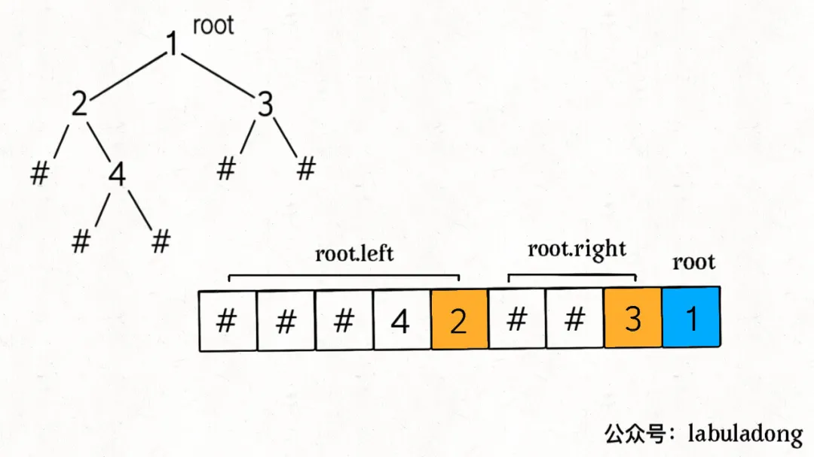
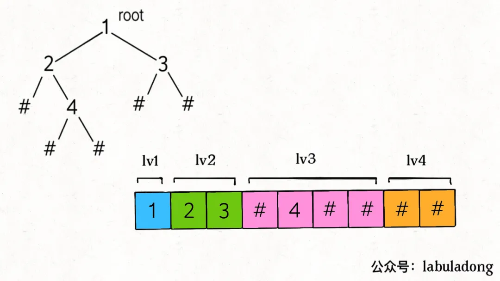

# 二叉树的序列化，就那几个框架，枯燥至极

<p align='center'>
<a href="https://github.com/labuladong/fucking-algorithm" target="view_window"></a>
<a href="https://www.zhihu.com/people/labuladong"></a>
<a href="https://i.loli.net/2020/10/10/MhRTyUKfXZOlQYN.jpg"></a>
<a href="https://space.bilibili.com/14089380"></a>
</p>

相关推荐：

- [如何高效寻找素数](https://labuladong.gitbook.io/algo/gao-pin-mian-shi-xi-lie/4.1-shu-xue-yun-suan-ji-qiao/da-yin-su-shu)
- [回溯算法最佳实践：解数独](https://labuladong.gitbook.io/algo/suan-fa-si-wei-xi-lie/3.1-hui-su-suan-fa-dfs-suan-fa-pian/sudoku)

读完本文，你不仅学会了算法套路，还可以顺便去 LeetCode 上拿下如下题目：

[297.二叉树的序列化和反序列化（困难）](https://leetcode-cn.com/problems/serialize-and-deserialize-binary-tree)

JSON 的运用非常广泛，比如我们经常将变成语言中的结构体序列化成 JSON 字符串，存入缓存或者通过网络发送给远端服务，消费者接受 JSON 字符串然后进行反序列化，就可以得到原始数据了。这就是「序列化」和「反序列化」的目的，以某种固定格式组织字符串，使得数据可以独立于编程语言。

那么假设现在有一棵用 Python 实现的二叉树，我想把它序列化成字符串，再在另一段程序里读取并还原这棵二叉树的结构，怎么办？这就需要对二叉树进行「序列化」和「反序列化」了。

**本文会用前序、中序、后序遍历的方式来序列化和反序列化二叉树，进一步，还会用迭代式的层级遍历来解决这个问题**。

接下来就用二叉树的遍历框架来给你看看二叉树到底能玩出什么骚操作。

## **一、题目描述**

「二叉树的序列化与反序列化」就是给你输入一棵二叉树的根节点 `root`，要求你实现如下一个类：

```python
class Codec:
    # 把一棵二叉树序列化成字符串
    def serialize(self, root):
        ...

    # 把字符串反序列化成二叉树
    def deserialize(self, data):
        ...
```python
我们可以用 `serialize` 方法将二叉树序列化成字符串，用 `deserialize` 方法将序列化的字符串反序列化成二叉树，至于以什么格式序列化和反序列化，这个完全由你决定。

比如说输入如下这样一棵二叉树：



`serialize` 方法也许会把它序列化成字符串 `2,1,#,6,3,#,#`，其中 `#` 表示 `None` 指针，那么把这个字符串再输入 `deserialize` 方法，依然可以还原出这棵二叉树。也就是说，这两个方法会成对儿使用，你只要保证他俩能够自洽就行了。

想象一下，二叉树结该是一个二维平面内的结构，而序列化出来的字符串是一个线性的一维结构。**所谓的序列化不过就是把结构化的数据「打平」，其实就是在考察二叉树的遍历方式**。

二叉树的遍历方式有哪些？递归遍历方式有前序遍历，中序遍历，后序遍历；迭代方式一般是层级遍历。本文就把这些方式都尝试一遍，来实现 `serialize` 方法和 `deserialize` 方法。

## **二、前序遍历解法**

前文 [学习数据结构和算法的框架思维](https://labuladong.gitbook.io/algo/shu-ju-jie-gou-xi-lie/2.1-zheng-ti-xue-xi-si-lu/xue-xi-shu-ju-jie-gou-he-suan-fa-de-gao-xiao-fang-fa) 说过了二叉树的几种遍历方式，前序遍历框架如下：

```python
def traverse(root):
    if root is None:
        return
    # 前序遍历的代码
    traverse(root.left)
    traverse(root.right)
```python
真的很简单，在递归遍历两棵子树之前写的代码就是前序遍历代码，那么请你看一看如下伪码：

```python
res = []
def traverse(root):
    if root is None:
        res.append(-1)  # 暂且用 -1 代表空指针 null
        return
    res.append(root.val)  # 前序遍历位置
    traverse(root.left)
    traverse(root.right)
```python
调用 `traverse` 函数之后，你是否可以立即想出这个 `res` 列表中元素的顺序是怎样的？比如如下二叉树（`#` 代表空指针 null），可以直观看出前序遍历做的事情：


那么 `res = [1,2,-1,4,-1,-1,3,-1,-1]`，这就是将二叉树「打平」到了一个列表中，其中 -1 代表 null。

那么，将二叉树打平到一个字符串中也是完全一样的：

```python
SEP = ","
NULL = "#"

def traverse(root, sb):
    if root is None:
        sb.append(NULL + SEP)
        return
    sb.append(str(root.val) + SEP)  # 前序遍历位置
    traverse(root.left, sb)
    traverse(root.right, sb)
```python
`list` 拼接字符串时可用 `"".join`，这里用列表当 `列表拼接`。用 `,` 作为分隔符，用 `#` 表示空指针 null，调用完 `traverse` 函数后，字符串应该是 `1,2,#,4,#,#,3,#,#,`。

至此，我们已经可以写出序列化函数 `serialize` 的代码了：

```python
SEP = ","
NULL = "#"

def serialize(self, root):
    sb = []
    self._serialize(root, sb)
    return "".join(sb)

def _serialize(self, root, sb):
    if root is None:
        sb.append(NULL + SEP)
        return
    sb.append(str(root.val) + SEP)
    self._serialize(root.left, sb)
    self._serialize(root.right, sb)
```python
现在，思考一下如何写 `deserialize` 函数，将字符串反过来构造二叉树。

首先我们可以把字符串转化成列表：

```python
data = "1,2,#,4,#,#,3,#,#,"
nodes = data.split(",")
```python
这样，`nodes` 列表就是二叉树的前序遍历结果，问题转化为：如何通过二叉树的前序遍历结果还原一棵二叉树？

PS：一般语境下，单单前序遍历结果是不能还原二叉树结构的，因为缺少空指针的信息，至少要得到前、中、后序遍历中的两种才能还原二叉树。但是这里的 `node` 列表包含空指针的信息，所以只使用 `node` 列表就可以还原二叉树。

根据我们刚才的分析，`nodes` 列表就是一棵打平的二叉树：



那么，反序列化过程也是一样，**先确定根节点 `root`，然后遵循前序遍历的规则，递归生成左右子树即可**：

```python
from collections import deque

def deserialize(self, data):
    nodes = deque(data.split(SEP))
    return self._deserialize(nodes)

def _deserialize(self, nodes):
    if not nodes:
        return None
    first = nodes.popleft()
    if first == NULL:
        return None
    root = TreeNode(int(first))
    root.left = self._deserialize(nodes)
    root.right = self._deserialize(nodes)
    return root
```python
我们发现，根据树的递归性质，`nodes` 列表的第一个元素就是一棵树的根节点，所以只要将列表的第一个元素取出作为根节点，剩下的交给递归函数去解决即可。

## 三、后序遍历解法

二叉树的后续遍历框架：

```python
def traverse(root):
    if root is None:
        return
    traverse(root.left)
    traverse(root.right)
    # 后序遍历的代码
```python
明白了前序遍历的解法，后序遍历就比较容易理解了，我们首先实现 `serialize` 序列化方法，只需要稍微修改辅助方法即可：

```python
def _serialize(self, root, sb):
    if root is None:
        sb.append(NULL + SEP)
        return
    self._serialize(root.left, sb)
    self._serialize(root.right, sb)
    sb.append(str(root.val) + SEP)  # 后序遍历位置
```python
我们把对字符串的拼接操作放到了后续遍历的位置，后序遍历导致结果的顺序发生变化：


关键的难点在于，如何实现后序遍历的 `deserialize` 方法呢？是不是也简单地将关键代码放到后序遍历的位置就行了呢：

```python
def _deserialize(self, nodes):
    if not nodes:
        return None
    root.left = self._deserialize(nodes)
    root.right = self._deserialize(nodes)
    last = nodes.popleft()  # 错误示例
    ...
```python
**没这么简单，显然上述代码是错误的**，变量都没声明呢，就开始用了？生搬硬套肯定是行不通的，回想刚才我们前序遍历方法中的 `deserialize` 方法，第一件事情在做什么？

**`deserialize` 方法首先寻找 `root` 节点的值，然后递归计算左右子节点**。那么我们这里也应该顺着这个基本思路走，后续遍历中，`root` 节点的值能不能找到？再看一眼刚才的图：



可见，`root` 的值是列表的最后一个元素。我们应该从后往前取出列表元素，先用最后一个元素构造 `root`，然后递归调用生成 `root` 的左右子树。**注意，根据上图，从后往前在 `nodes` 列表中取元素，一定要先构造 `root.right` 子树，后构造 `root.left` 子树**。

看完整代码：

```python
def deserialize(self, data):
    nodes = deque(data.split(SEP))
    return self._deserialize(nodes)

def _deserialize(self, nodes):
    if not nodes:
        return None
    last = nodes.pop()
    if last == NULL:
        return None
    root = TreeNode(int(last))
    root.right = self._deserialize(nodes)
    root.left = self._deserialize(nodes)
    return root
```python
至此，后续遍历实现的序列化、反序列化方法也都实现了。

## 四、中序遍历解法

先说结论，中序遍历的方式行不通，因为无法实现反序列化方法 `deserialize`。

序列化方法 `serialize` 依然容易，只要把字符串的拼接操作放到中序遍历的位置就行了：

```python
def _serialize(self, root, sb):
    if root is None:
        sb.append(NULL + SEP)
        return
    self._serialize(root.left, sb)
    sb.append(str(root.val) + SEP)  # 中序遍历位置
    self._serialize(root.right, sb)
```python
但是，我们刚才说了，要想实现反序列方法，首先要构造 `root` 节点。前序遍历得到的 `nodes` 列表中，第一个元素是 `root` 节点的值；后序遍历得到的 `nodes` 列表中，最后一个元素是 `root` 节点的值。

你看上面这段中序遍历的代码，`root` 的值被夹在两棵子树的中间，也就是在 `nodes` 列表的中间，我们不知道确切的索引位置，所以无法找到 `root` 节点，也就无法进行反序列化。

## 五、层级遍历解法

首先，先写出层级遍历二叉树的代码框架：

```python
from collections import deque

def traverse(root):
    if root is None:
        return
    q = deque([root])
    while q:
        cur = q.popleft()
        print(cur.val)  # 层级遍历代码位置
        if cur.left:
            q.append(cur.left)
        if cur.right:
            q.append(cur.right)
```python
**上述代码是标准的二叉树层级遍历框架**，从上到下，从左到右打印每一层二叉树节点的值，可以看到，队列 `q` 中不会存在 None 指针。

不过我们在反序列化的过程中是需要记录空指针 null 的，所以可以把标准的层级遍历框架略作修改：

```python
def traverse(root):
    if root is None:
        return
    q = deque([root])
    while q:
        cur = q.popleft()
        if cur is None:
            continue
        print(cur.val)
        q.append(cur.left)
        q.append(cur.right)
```python
这样也可以完成层级遍历，只不过我们把对空指针的检验从「将元素加入队列」的时候改成了「从队列取出元素」的时候。

那么我们完全仿照这个框架即可写出序列化方法：

```python
def serialize(self, root):
    if root is None:
        return ""
    sb = []
    q = deque([root])
    while q:
        cur = q.popleft()
        if cur is None:
            sb.append(NULL + SEP)
            continue
        sb.append(str(cur.val) + SEP)
        q.append(cur.left)
        q.append(cur.right)
    return "".join(sb)
```python
层级遍历序列化得出的结果如下图：



可以看到，每一个非空节点都会对应两个子节点，**那么反序列化的思路也是用队列进行层级遍历，同时用索引 `i` 记录对应子节点的位置**：

```python
def deserialize(self, data):
    if not data:
        return None
    nodes = data.split(SEP)
    root = TreeNode(int(nodes[0]))
    q = deque([root])
    i = 1
    while q:
        parent = q.popleft()
        left = nodes[i]
        i += 1
        if left != NULL:
            parent.left = TreeNode(int(left))
            q.append(parent.left)
        else:
            parent.left = None
        right = nodes[i]
        i += 1
        if right != NULL:
            parent.right = TreeNode(int(right))
            q.append(parent.right)
        else:
            parent.right = None
    return root
```python
这段代码可以考验一下你的框架思维。仔细看一看 for 循环部分的代码，发现这不就是标准层级遍历的代码衍生出来的嘛：

```python
while q:
    cur = q.popleft()
    if cur.left:
        q.append(cur.left)
    if cur.right:
        q.append(cur.right)
```python
只不过，标准的层级遍历在操作二叉树节点 `TreeNode`，而我们的函数在操作 `nodes[i]`，这也恰恰是反序列化的目的嘛。
