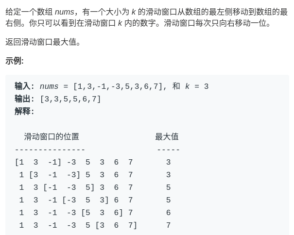
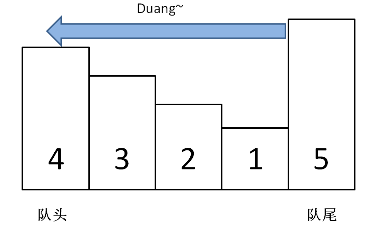

# 特殊数据结构：单调队列


<p align='center'>
<a href="https://github.com/labuladong/fucking-algorithm" target="view_window"></a>
<a href="https://www.zhihu.com/people/labuladong"></a>
<a href="https://i.loli.net/2020/10/10/MhRTyUKfXZOlQYN.jpg"></a>
<a href="https://space.bilibili.com/14089380"></a>
</p>
相关推荐：
  * [几个反直觉的概率问题](https://labuladong.gitbook.io/algo)
  * [Git/SQL/正则表达式的在线练习平台](https://labuladong.gitbook.io/algo)

读完本文，你不仅学会了算法套路，还可以顺便去 LeetCode 上拿下如下题目：

[239.滑动窗口最大值](https://leetcode-cn.com/problems/sliding-window-maximum)

---

前文讲了一种特殊的数据结构「单调栈」monotonic stack，解决了一类问题「Next Greater Number」，本文写一个类似的数据结构「单调队列」。

也许这种数据结构的名字你没听过，其实没啥难的，就是一个「队列」，只是使用了一点巧妙的方法，使得队列中的元素单调递增（或递减）。这个数据结构有什么用？可以解决滑动窗口的一系列问题。

看一道 LeetCode 题目，难度 hard：



## 一、搭建解题框架

这道题不复杂，难点在于如何在 O(1) 时间算出每个「窗口」中的最大值，使得整个算法在线性时间完成。在之前我们探讨过类似的场景，得到一个结论：

在一堆数字中，已知最值，如果给这堆数添加一个数，那么比较一下就可以很快算出最值；但如果减少一个数，就不一定能很快得到最值了，而要遍历所有数重新找最值。

回到这道题的场景，每个窗口前进的时候，要添加一个数同时减少一个数，所以想在 O(1) 的时间得出新的最值，就需要「单调队列」这种特殊的数据结构来辅助了。

一个普通的队列一定有这两个操作：

```python
class Queue:
    def push(self, n):
        ...  # 在队尾加入元素 n
    def pop(self):
        ...  # 删除队头元素
```python
一个「单调队列」的操作也差不多：

```python
class MonotonicQueue:
    def push(self, n):
        ...  # 在队尾添加元素 n
    def max(self):
        ...  # 返回当前队列中的最大值
    def pop(self, n):
        ...  # 队头元素如果是 n，删除它
```python
当然，这几个 API 的实现方法肯定跟一般的 Queue 不一样，不过我们暂且不管，而且认为这几个操作的时间复杂度都是 O(1)，先把这道「滑动窗口」问题的解答框架搭出来：

```python
from collections import deque

def max_sliding_window(nums, k):
    window = MonotonicQueue()
    res = []
    for i in range(len(nums)):
        if i < k - 1:
            window.push(nums[i])
        else:
            window.push(nums[i])
            res.append(window.max())
            window.pop(nums[i - k + 1])
    return res
```python


这个思路很简单，能理解吧？下面我们开始重头戏，单调队列的实现。

## 二、实现单调队列数据结构

首先我们要认识另一种数据结构：deque，即双端队列。很简单：

```python
from collections import deque

# push_front / push_back / pop_front / pop_back / front / back
# 复杂度均为 O(1)
```python
「单调队列」的核心思路和「单调栈」类似。单调队列的 push 方法依然在队尾添加元素，但是要把前面比新元素小的元素都删掉：

```python
class MonotonicQueue:
    def __init__(self):
        self.data = deque()

    def push(self, n):
        while self.data and self.data[-1] < n:
            self.data.pop()
        self.data.append(n)
```python
你可以想象，加入数字的大小代表人的体重，把前面体重不足的都压扁了，直到遇到更大的量级才停住。



如果每个元素被加入时都这样操作，最终单调队列中的元素大小就会保持一个单调递减的顺序，因此我们的 max() API 可以可以这样写：

```python
    def max(self):
        return self.data[0]
```python
pop() API 在队头删除元素 n，也很好写：

```python
    def pop(self, n):
        if self.data and self.data[0] == n:
            self.data.popleft()
```python
之所以要判断 `data[0] == n`，是因为我们想删除的队头元素 n 可能已经被「压扁」了，这时候就不用删除了：


至此，单调队列设计完毕，看下完整的解题代码：

```python
class MonotonicQueue:
    def __init__(self):
        self.data = deque()

    def push(self, n):
        while self.data and self.data[-1] < n:
            self.data.pop()
        self.data.append(n)

    def max(self):
        return self.data[0]

    def pop(self, n):
        if self.data and self.data[0] == n:
            self.data.popleft()


def max_sliding_window(nums, k):
    window = MonotonicQueue()
    res = []
    for i in range(len(nums)):
        if i < k - 1:
            window.push(nums[i])
        else:
            window.push(nums[i])
            res.append(window.max())
            window.pop(nums[i - k + 1])
    return res
```python
## **三、算法复杂度分析**

读者可能疑惑，push 操作中含有 while 循环，时间复杂度不是 O(1) 呀，那么本算法的时间复杂度应该不是线性时间吧？

单独看 push 操作的复杂度确实不是 O(1)，但是算法整体的复杂度依然是 O(N) 线性时间。要这样想，nums 中的每个元素最多被 push_back 和 pop_back 一次，没有任何多余操作，所以整体的复杂度还是 O(N)。

空间复杂度就很简单了，就是窗口的大小 O(k)。

## **四、最后总结**

有的读者可能觉得「单调队列」和「优先级队列」比较像，实际上差别很大的。

单调队列在添加元素的时候靠删除元素保持队列的单调性，相当于抽取出某个函数中单调递增（或递减）的部分；而优先级队列（二叉堆）相当于自动排序，差别大了去了。

赶紧去拿下 LeetCode 第 239 道题吧～
