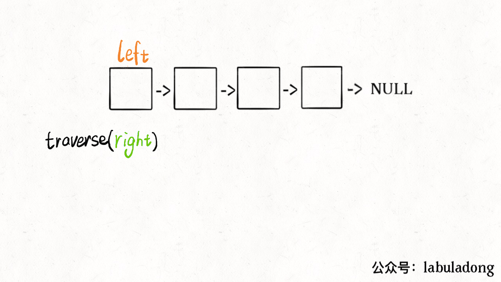
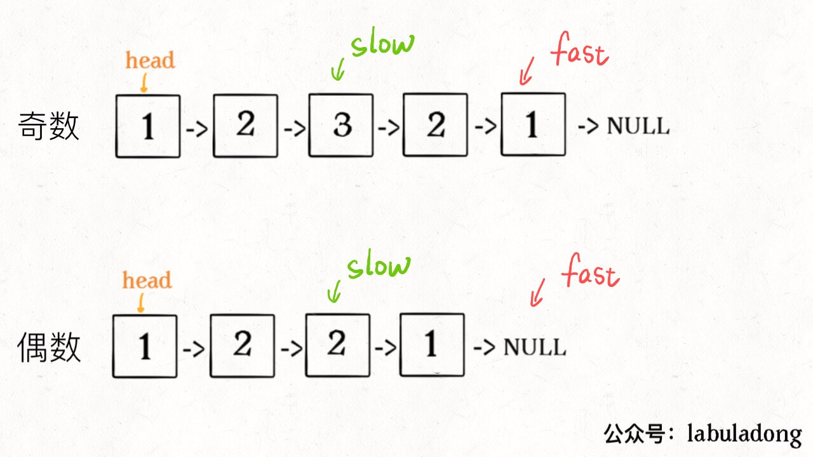
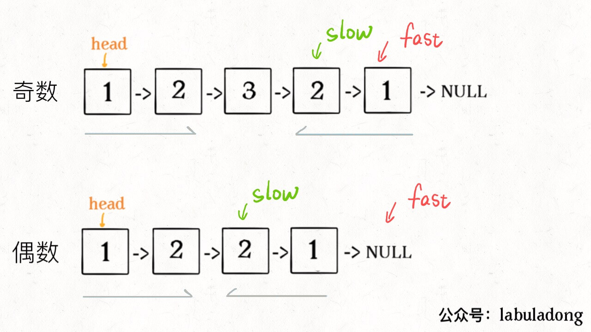
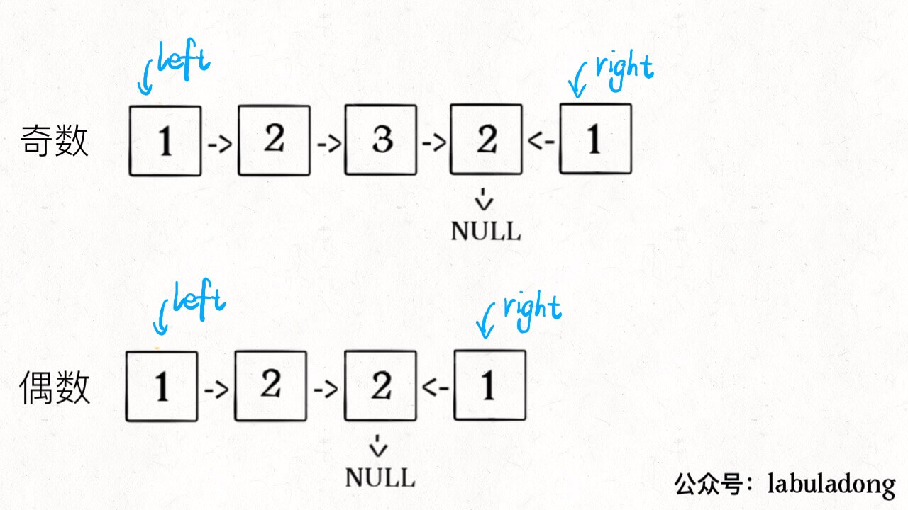
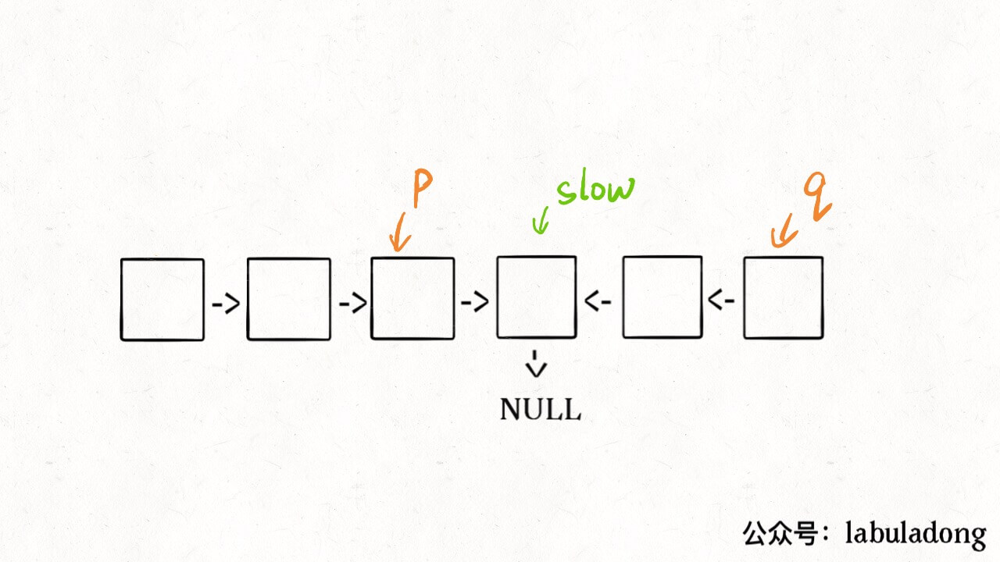

# 如何高效判断回文链表


<p align='center'>
<a href="https://github.com/labuladong/fucking-algorithm" target="view_window"></a>
<a href="https://www.zhihu.com/people/labuladong"></a>
<a href="https://i.loli.net/2020/10/10/MhRTyUKfXZOlQYN.jpg"></a>
<a href="https://space.bilibili.com/14089380"></a>
</p>
相关推荐：
  * [如何高效进行模幂运算](https://labuladong.gitbook.io/algo)
  * [一文学会递归解题](https://labuladong.gitbook.io/algo)

读完本文，你不仅学会了算法套路，还可以顺便去 LeetCode 上拿下如下题目：

[234.回文链表](https://leetcode-cn.com/problems/palindrome-linked-list)

---

我们之前有两篇文章写了回文串和回文序列相关的问题。

**寻找**回文串的核心思想是从中心向两端扩展：

```python
def palindrome(s, l, r):
    while l >= 0 and r < len(s) and s[l] == s[r]:
        l -= 1
        r += 1
    return s[l + 1:r]
```python
因为回文串长度可能为奇数也可能是偶数，长度为奇数时只存在一个中心点，而长度为偶数时存在两个中心点，所以上面这个函数需要传入`l`和`r`。

而**判断**一个字符串是不是回文串就简单很多，不需要考虑奇偶情况，只需要「双指针技巧」，从两端向中间逼近即可：

```python
def is_palindrome(s):
    left, right = 0, len(s) - 1
    while left < right:
        if s[left] != s[right]:
            return False
        left += 1
        right -= 1
    return True
```python
以上代码很好理解吧，**因为回文串是对称的，所以正着读和倒着读应该是一样的，这一特点是解决回文串问题的关键**。

下面扩展这一最简单的情况，来解决：如何判断一个「单链表」是不是回文。

## 一、判断回文单链表

输入一个单链表的头结点，判断这个链表中的数字是不是回文：

```python
class ListNode:
    def __init__(self, val=0, next=None):
        self.val = val
        self.next = next

def is_palindrome(head):
    ...

# 输入: 1->2->None
# 输出: False

# 输入: 1->2->2->1->null
# 输出: True
```python
这道题的关键在于，单链表无法倒着遍历，无法使用双指针技巧。那么最简单的办法就是，把原始链表反转存入一条新的链表，然后比较这两条链表是否相同。关于如何反转链表，可以参见前文「递归操作链表」。

其实，**借助二叉树后序遍历的思路，不需要显式反转原始链表也可以倒序遍历链表**，下面来具体聊聊。

对于二叉树的几种遍历方式，我们再熟悉不过了：

```python
def traverse(root):
    traverse(root.left)   # 中序遍历
    traverse(root.right)  # 后序遍历
```python
在「学习数据结构的框架思维」中说过，链表兼具递归结构，树结构不过是链表的衍生。那么，**链表其实也可以有前序遍历和后序遍历**：

```python
def traverse(head):
    traverse(head.next)  # 后序遍历
```python
这个框架有什么指导意义呢？如果我想正序打印链表中的`val`值，可以在前序遍历位置写代码；反之，如果想倒序遍历链表，就可以在后序遍历位置操作：

```python
def traverse(head):
    if head is None:
        return
    traverse(head.next)
    print(head.val)
```python
说到这了，其实可以稍作修改，模仿双指针实现回文判断的功能：

```python
left = None

def is_palindrome(head):
    global left
    left = head
    return traverse(head)

def traverse(right):
    if right is None:
        return True
    res = traverse(right.next)
    global left
    res = res and (right.val == left.val)
    left = left.next
    return res
```python
这么做的核心逻辑是什么呢？**实际上就是把链表节点放入一个栈，然后再拿出来，这时候元素顺序就是反的**，只不过我们利用的是递归函数的堆栈而已。



当然，无论造一条反转链表还是利用后续遍历，算法的时间和空间复杂度都是 O(N)。下面我们想想，能不能不用额外的空间，解决这个问题呢？

## 二、优化空间复杂度

更好的思路是这样的：

**1、先通过「双指针技巧」中的快慢指针来找到链表的中点**：

```python
slow = fast = head
while fast is not None and fast.next is not None:
    slow = slow.next
    fast = fast.next.next
```python


**2、如果`fast`指针没有指向`None`，说明链表长度为奇数，`slow`还要再前进一步**：

```python
if fast is not None:
    slow = slow.next
```python


**3、从`slow`开始反转后面的链表，现在就可以开始比较回文串了**：

```python
left = head
right = reverse(slow)
while right is not None:
    if left.val != right.val:
        return False
    left = left.next
    right = right.next
return True
```python


至此，把上面 3 段代码合在一起就高效地解决这个问题了，其中`reverse`函数很容易实现：

```python
def reverse(head):
    pre, cur = None, head
    while cur is not None:
        nxt = cur.next
        cur.next = pre
        pre = cur
        cur = nxt
    return pre
```python


算法总体的时间复杂度 O(N)，空间复杂度 O(1)，已经是最优的了。

我知道肯定有读者会问：这种解法虽然高效，但破坏了输入链表的原始结构，能不能避免这个瑕疵呢？

其实这个问题很好解决，关键在于得到`p, q`这两个指针位置：



这样，只要在函数 return 之前加一段代码即可恢复原先链表顺序：

```python
p.next = reverse(q)
```python
篇幅所限，我就不写了，读者可以自己尝试一下。

## 三、最后总结

首先，寻找回文串是从中间向两端扩展，判断回文串是从两端向中间收缩。对于单链表，无法直接倒序遍历，可以造一条新的反转链表，可以利用链表的后序遍历，也可以用栈结构倒序处理单链表。

具体到回文链表的判断问题，由于回文的特殊性，可以不完全反转链表，而是仅仅反转部分链表，将空间复杂度降到 O(1)。
