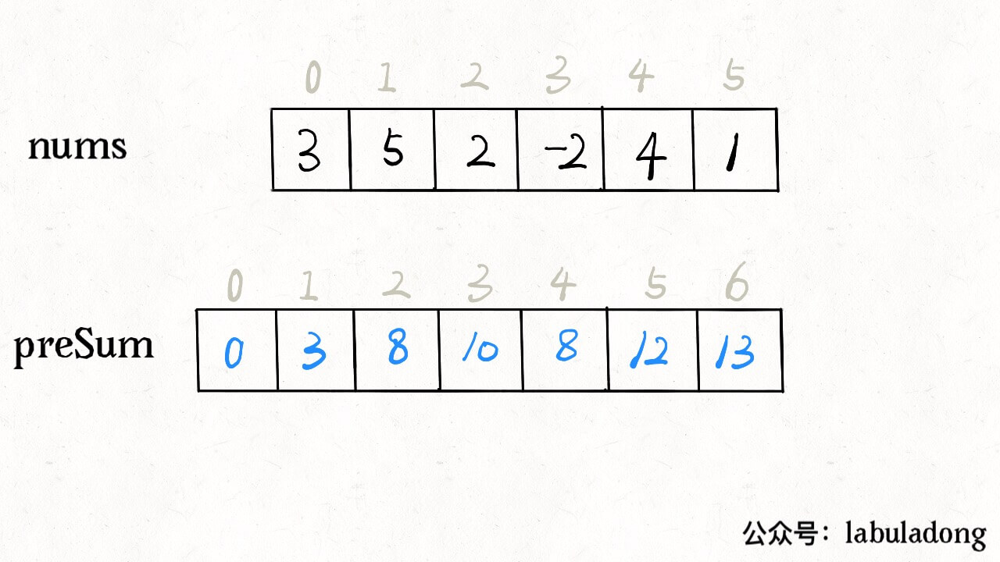
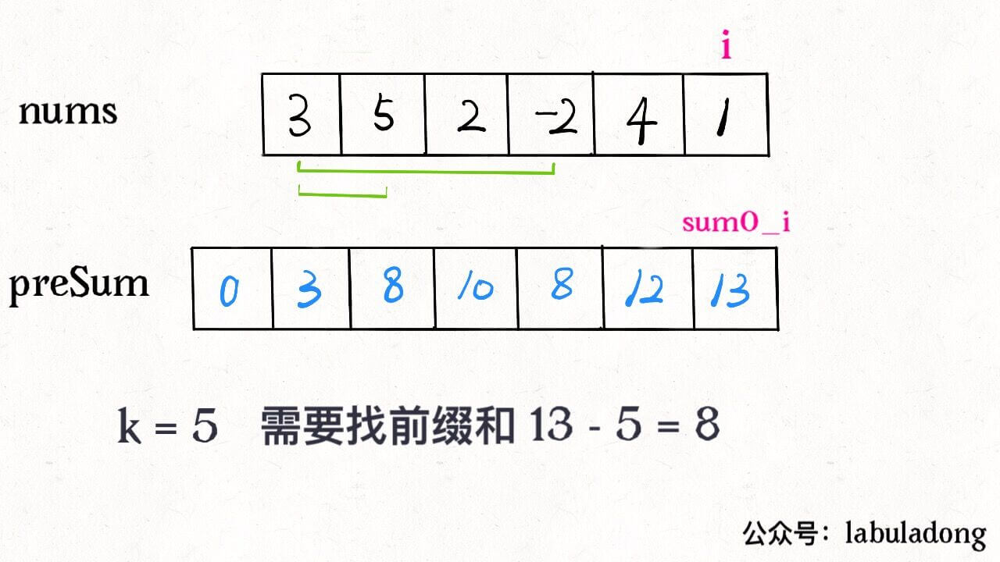

# 前缀和技巧


<p align='center'>
<a href="https://github.com/labuladong/fucking-algorithm" target="view_window"></a>
<a href="https://www.zhihu.com/people/labuladong"></a>
<a href="https://i.loli.net/2020/10/10/MhRTyUKfXZOlQYN.jpg"></a>
<a href="https://space.bilibili.com/14089380"></a>
</p>
相关推荐：
  * [如何去除有序数组的重复元素](https://labuladong.gitbook.io/algo)
  * [区间调度之区间合并问题](https://labuladong.gitbook.io/algo)

读完本文，你不仅学会了算法套路，还可以顺便去 LeetCode 上拿下如下题目：

[560.和为K的子数组](https://leetcode-cn.com/problems/subarray-sum-equals-k)

---

今天来聊一道简单却十分巧妙的算法问题：算出一共有几个和为 `k` 的子数组。


那我把所有子数组都穷举出来，算它们的和，看看谁的和等于 `k` 不就行了。

关键是，**如何快速得到某个子数组的和呢**，比如说给你一个数组 `nums`，让你实现一个接口 `sum(i, j)`，这个接口要返回 `nums[i..j]` 的和，而且会被多次调用，你怎么实现这个接口呢？

因为接口要被多次调用，显然不能每次都去遍历 `nums[i..j]`，有没有一种快速的方法在 O(1) 时间内算出 `nums[i..j]` 呢？这就需要**前缀和**技巧了。

## 一、什么是前缀和

前缀和的思路是这样的，对于一个给定的数组 `nums`，我们额外开辟一个前缀和数组进行预处理：

```python
from typing import List

n = len(nums)
pre_sum = [0] * (n + 1)
for i in range(n):
    pre_sum[i + 1] = pre_sum[i] + nums[i]
```



这个前缀和数组 `pre_sum` 的含义也很好理解，`pre_sum[i]` 就是 `nums[0..i-1]` 的和。那么如果我们想求 `nums[i..j]` 的和，只需要一步操作 `pre_sum[j+1]-pre_sum[i]` 即可，而不需要重新去遍历数组了。

回到这个子数组问题，我们想求有多少个子数组的和为 k，借助前缀和技巧很容易写出一个解法：

```python
from typing import List

class Solution:
    def subarraySum(self, nums: List[int], k: int) -> int:
        n = len(nums)
        pre_sum = [0] * (n + 1)
        for i in range(n):
            pre_sum[i + 1] = pre_sum[i] + nums[i]

        ans = 0
        for i in range(1, n + 1):
            for j in range(i):
                if pre_sum[i] - pre_sum[j] == k:
                    ans += 1
        return ans
```

这个解法的时间复杂度 `O(N^2)` 空间复杂度 `O(N)`，并不是最优的解法。不过通过这个解法理解了前缀和数组的工作原理之后，可以使用一些巧妙的办法把时间复杂度进一步降低。

## 二、优化解法

前面的解法有嵌套的 for 循环：

```python
for i in range(1, n + 1):
    for j in range(i):
        if pre_sum[i] - pre_sum[j] == k:
            ans += 1
```

第二层 for 循环在干嘛呢？翻译一下就是，**在计算，有几个 `j` 能够使得 `pre_sum[i]` 和 `pre_sum[j]` 的差为 k。**毎找到一个这样的 `j`，就把结果加一。

我们可以把 if 语句里的条件判断移项，这样写：

```python
if pre_sum[j] == pre_sum[i] - k:
    ans += 1
```

优化的思路是：**我直接记录下有几个 `pre_sum[j]` 和 `pre_sum[i] - k` 相等，直接更新结果，就避免了内层的 for 循环**。我们可以用哈希表，在记录前缀和的同时记录该前缀和出现的次数。

```python
from collections import defaultdict
from typing import Dict, List

class Solution:
    def subarraySum(self, nums: List[int], k: int) -> int:
        pre_sum: Dict[int, int] = defaultdict(int)
        pre_sum[0] = 1

        ans = 0
        sum0_i = 0
        for num in nums:
            sum0_i += num
            sum0_j = sum0_i - k
            if sum0_j in pre_sum:
                ans += pre_sum[sum0_j]
            pre_sum[sum0_i] = pre_sum.get(sum0_i, 0) + 1
        return ans
```

比如说下面这个情况，需要前缀和 8 就能找到和为 k 的子数组了，之前的暴力解法需要遍历数组去数有几个 8，而优化解法借助哈希表可以直接得知有几个前缀和为 8。



这样，就把时间复杂度降到了 `O(N)`，是最优解法了。

## 三、总结

前缀和不难，却很有用，主要用于处理数组区间的问题。

比如说，让你统计班上同学考试成绩在不同分数段的百分比，也可以利用前缀和技巧：

```python
scores = [...]  # 存储着所有同学的分数
count = [0] * 151
for score in scores:
    count[score] += 1
for i in range(1, len(count)):
    count[i] = count[i] + count[i - 1]
```

这样，给你任何一个分数段，你都能通过前缀和相减快速计算出这个分数段的人数，百分比也就很容易计算了。

但是，稍微复杂一些的算法问题，不止考察简单的前缀和技巧。比如本文探讨的这道题目，就需要借助前缀和的思路做进一步的优化，借助哈希表去除不必要的嵌套循环。可见对题目的理解和细节的分析能力对于算法的优化是至关重要的。

希望本文对你有帮助。
