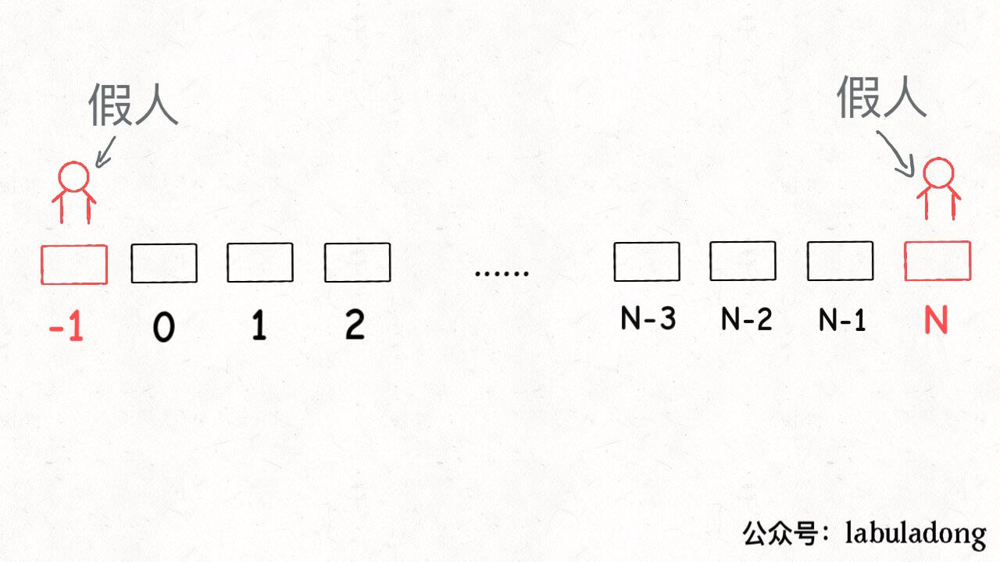
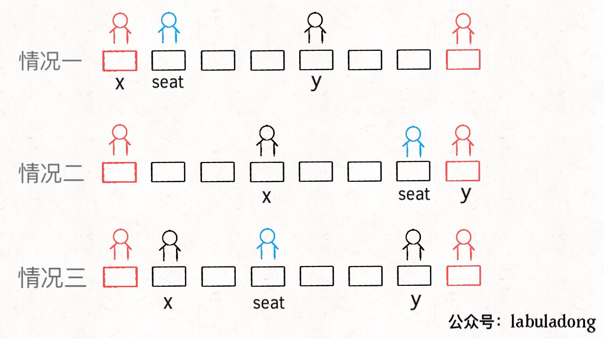
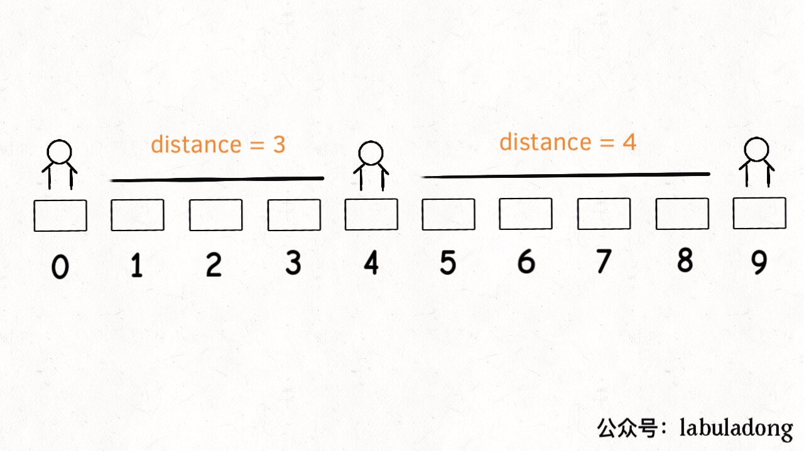
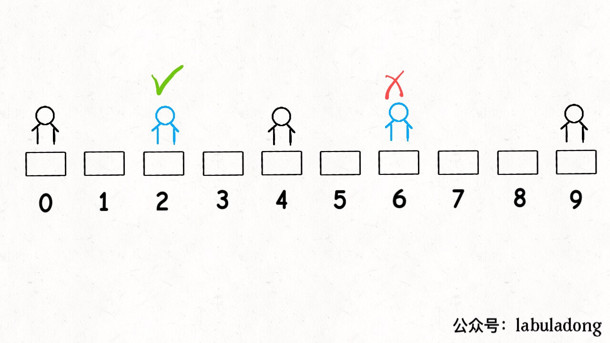
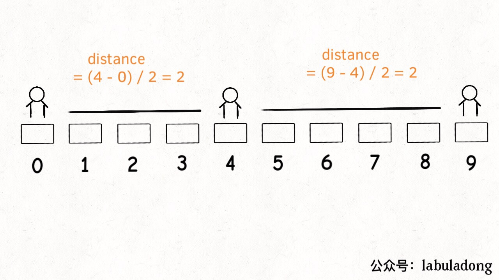

# 如何调度考生的座位


<p align='center'>
<a href="https://github.com/labuladong/fucking-algorithm" target="view_window"></a>
<a href="https://www.zhihu.com/people/labuladong"></a>
<a href="https://i.loli.net/2020/10/10/MhRTyUKfXZOlQYN.jpg"></a>
<a href="https://space.bilibili.com/14089380"></a>
</p>
相关推荐：
  * [一个方法团灭 LeetCode 股票买卖问题](https://labuladong.gitbook.io/algo)
  * [Linux shell 的实用小技巧](https://labuladong.gitbook.io/algo)

读完本文，你不仅学会了算法套路，还可以顺便去 LeetCode 上拿下如下题目：

[855.考场就座](https://leetcode-cn.com/problems/exam-room)

---

这是 LeetCode 第 855 题，有趣且具有一定技巧性。这种题目并不像动态规划这类算法拼智商，而是看你对常用数据结构的理解和写代码的水平，个人认为值得重视和学习。

另外说句题外话，很多读者都问，算法框架是如何总结出来的，其实框架反而是慢慢从细节里抠出来的。希望大家看了我们的文章之后，最好能抽时间把相关的问题亲自做一做，纸上得来终觉浅，绝知此事要躬行嘛。

先来描述一下题目：假设有一个考场，考场有一排共 `N` 个座位，索引分别是 `[0..N-1]`，考生会**陆续**进入考场考试，并且可能在**任何时候**离开考场。

你作为考官，要安排考生们的座位，满足：**每当一个学生进入时，你需要最大化他和最近其他人的距离；如果有多个这样的座位，安排到他到索引最小的那个座位**。这很符合实际情况对吧，

也就是请你实现下面这样一个类：

```python
class ExamRoom:
    # 构造函数，传入座位总数 N
    def __init__(self, N: int):
        ...

    # 来了一名考生，返回你给他分配的座位
    def seat(self) -> int:
        ...

    # 坐在 p 位置的考生离开了
    # 可以认为 p 位置一定坐有考生
    def leave(self, p: int) -> None:
        ...
```python
比方说考场有 5 个座位，分别是 `[0..4]`：

第一名考生进入时（调用 `seat()`），坐在任何位置都行，但是要给他安排索引最小的位置，也就是返回位置 0。

第二名学生进入时（再调用 `seat()`），要和旁边的人距离最远，也就是返回位置 4。

第三名学生进入时，要和旁边的人距离最远，应该做到中间，也就是座位 2。

如果再进一名学生，他可以坐在座位 1 或者 3，取较小的索引 1。

以此类推。

刚才所说的情况，没有调用 `leave` 函数，不过读者肯定能够发现规律：

**如果将每两个相邻的考生看做线段的两端点，新安排考生就是找最长的线段，然后让该考生在中间把这个线段「二分」，中点就是给他分配的座位。`leave(p)` 其实就是去除端点 `p`，使得相邻两个线段合并为一个**。

核心思路很简单对吧，所以这个问题实际上实在考察你对数据结构的理解。对于上述这个逻辑，你用什么数据结构来实现呢？

## 一、思路分析

根据上述思路，首先需要把坐在教室的学生抽象成线段，我们可以简单的用一个大小为 2 的数组表示。

另外，思路需要我们找到「最长」的线段，还需要去除线段，增加线段。

**但凡遇到在动态过程中取最值的要求，肯定要使用有序数据结构，我们常用的数据结构就是二叉堆和平衡二叉搜索树了**。二叉堆实现的优先级队列取最值的时间复杂度是 O(logN)，但是只能删除最大值。平衡二叉树也可以取最值，也可以修改、删除任意一个值，而且时间复杂度都是 O(logN)。

综上，二叉堆不能满足 `leave` 操作，应该使用平衡二叉树。在 Python 中可用有序列表配合排序来模拟有序集合，或使用 `sortedcontainers` 等第三方结构维护有序性。

这里顺便提一下，一说到集合（Set）或者映射（Map），有的读者可能就想当然的认为是哈希集合（set）或者哈希表（dict），这样理解是有点问题的。

因为哈希集合/映射底层是由哈希函数和数组实现的，特性是遍历无固定顺序，但是操作效率高，时间复杂度为 O(1)。

而集合/映射还可以依赖其他底层数据结构，常见的就是红黑树（一种平衡二叉搜索树），特性是自动维护其中元素的顺序，操作效率是 O(logN)。这种一般称为「有序集合/映射」。

我们使用有序列表来维护线段长度的有序性，快速查找最大线段，快速删除和插入。

## 二、简化问题

首先，如果有多个可选座位，需要选择索引最小的座位对吧？**我们先简化一下问题，暂时不管这个要求**，实现上述思路。

这个问题还用到一个常用的编程技巧，就是使用一个「虚拟线段」让算法正确启动，这就和链表相关的算法需要「虚拟头结点」一个道理。

```python
class ExamRoom:
    def __init__(self, N: int):
        self.N = N
        # 将端点 p 映射到以 p 为左端点的线段
        self.start_map: dict[int, list[int]] = {}
        # 将端点 p 映射到以 p 为右端点的线段
        self.end_map: dict[int, list[int]] = {}
        # 根据线段长度从小到大存放所有线段
        self.pq: list[list[int]] = []
        # 在有序集合中先放一个虚拟线段
        self.add_interval([-1, N])

    def remove_interval(self, intv: list[int]) -> None:
        self.pq.remove(intv)
        del self.start_map[intv[0]]
        del self.end_map[intv[1]]

    def add_interval(self, intv: list[int]) -> None:
        self.pq.append(intv)
        self.pq.sort(key=lambda a: self.distance(a))
        self.start_map[intv[0]] = intv
        self.end_map[intv[1]] = intv

    def distance(self, intv: list[int]) -> int:
        return intv[1] - intv[0] - 1
```python
「虚拟线段」其实就是为了将所有座位表示为一个线段：



有了上述铺垫，主要 API `seat` 和 `leave` 就可以写了：

```python
    def seat(self) -> int:
        longest = self.pq[-1]
        x, y = longest[0], longest[1]
        if x == -1:
            seat = 0
        elif y == self.N:
            seat = self.N - 1
        else:
            seat = (y - x) // 2 + x
        left = [x, seat]
        right = [seat, y]
        self.remove_interval(longest)
        self.add_interval(left)
        self.add_interval(right)
        return seat

    def leave(self, p: int) -> None:
        right = self.start_map[p]
        left = self.end_map[p]
        merged = [left[0], right[1]]
        self.remove_interval(left)
        self.remove_interval(right)
        self.add_interval(merged)
```python


至此，算法就基本实现了，代码虽多，但思路很简单：找最长的线段，从中间分隔成两段，中点就是 `seat()` 的返回值；找 `p` 的左右线段，合并成一个线段，这就是 `leave(p)` 的逻辑。

## 三、进阶问题

但是，题目要求多个选择时选择索引最小的那个座位，我们刚才忽略了这个问题。比如下面这种情况会出错：



现在有序集合里有线段 `[0,4]` 和 `[4,9]`，那么最长线段 `longest` 就是后者，按照 `seat` 的逻辑，就会分割 `[4,9]`，也就是返回座位 6。但正确答案应该是座位 2，因为 2 和 6 都满足最大化相邻考生距离的条件，二者应该取较小的。



**遇到题目的这种要求，解决方式就是修改有序数据结构的排序方式**。具体到这个问题，就是修改比较函数逻辑：

```python
    def _sort_key(self, intv: list[int]) -> tuple[int, int]:
        dist = self.distance(intv)
        # 如果长度相同，就比较索引（距离相同时优先选起点更小的线段）
        return (dist, -intv[0])

    def add_interval(self, intv: list[int]) -> None:
        self.pq.append(intv)
        self.pq.sort(key=self._sort_key)
        self.start_map[intv[0]] = intv
        self.end_map[intv[1]] = intv
```python
除此之外，还要改变 `distance` 函数，**不能简单地让它计算一个线段两个端点间的长度，而是让它计算该线段中点和端点之间的长度**。

```python
    def distance(self, intv: list[int]) -> int:
        x, y = intv[0], intv[1]
        if x == -1:
            return y
        if y == self.N:
            return self.N - 1 - x
        return (y - x) // 2
```python


这样，`[0,4]` 和 `[4,9]` 的 `distance` 值就相等了，算法会比较二者的索引，取较小的线段进行分割。到这里，这道算法题目算是完全解决了。

## 四、最后总结

本文聊的这个问题其实并不算难，虽然看起来代码很多。核心问题就是考察有序数据结构的理解和使用，来梳理一下。

处理动态问题一般都会用到有序数据结构，比如平衡二叉搜索树和二叉堆，二者的时间复杂度差不多，但前者支持的操作更多。

既然平衡二叉搜索树这么好用，还用二叉堆干嘛呢？因为二叉堆底层就是数组，实现简单啊，详见旧文「二叉堆详解」。你实现个红黑树试试？操作复杂，而且消耗的空间相对来说会多一些。具体问题，还是要选择恰当的数据结构来解决。

希望本文对大家有帮助。
