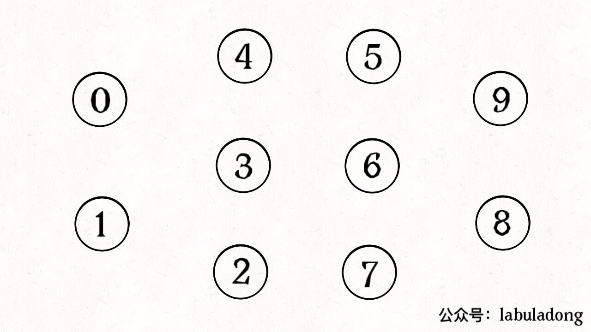
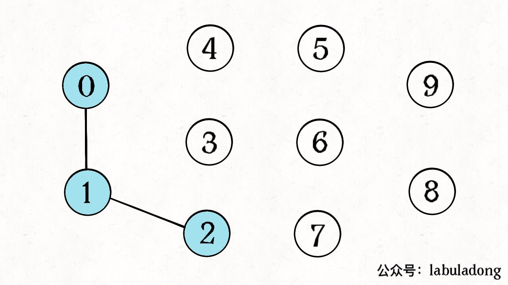
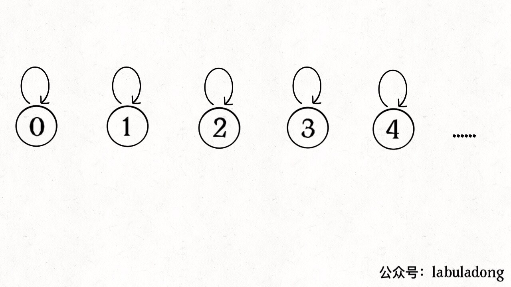
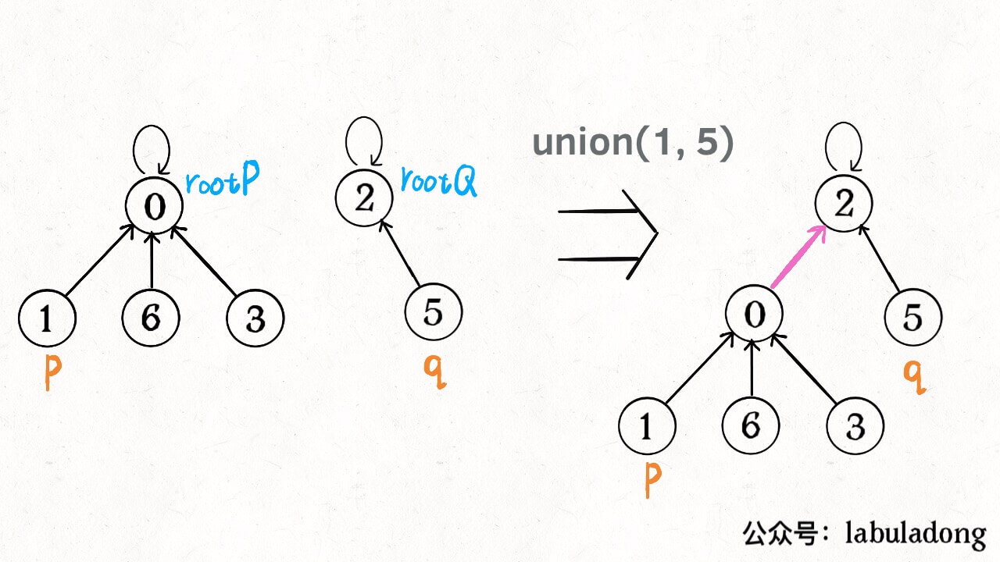
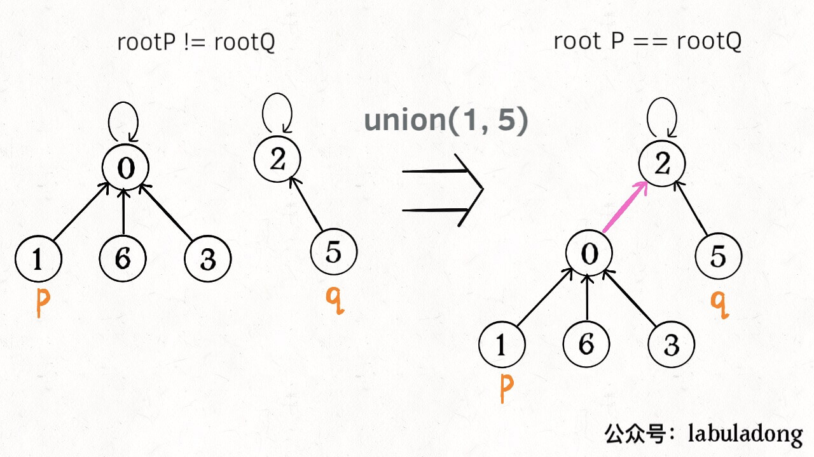
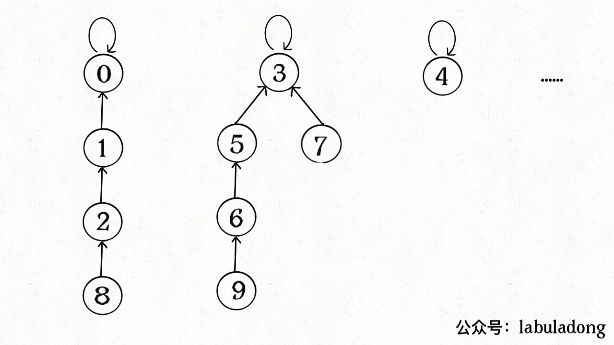
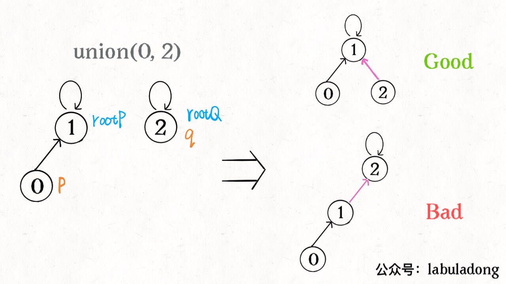
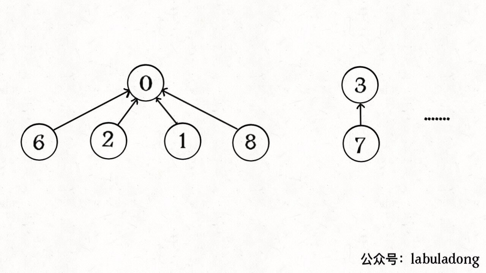
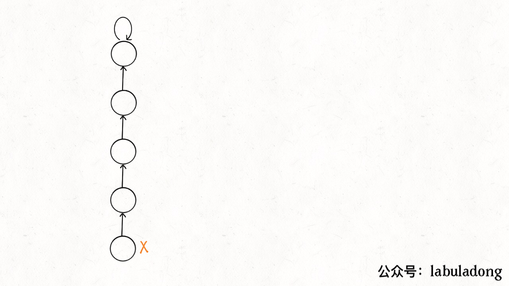

# Union-Find算法详解


<p align='center'>
<a href="https://github.com/labuladong/fucking-algorithm" target="view_window"></a>
<a href="https://www.zhihu.com/people/labuladong"></a>
<a href="https://i.loli.net/2020/10/10/MhRTyUKfXZOlQYN.jpg"></a>
<a href="https://space.bilibili.com/14089380"></a>
</p>
相关推荐：
  * [一文秒杀四道原地修改数组的算法题](https://labuladong.gitbook.io/algo)
  * [学习算法和数据结构的思路指南](https://labuladong.gitbook.io/algo)

---

今天讲讲 Union-Find 算法，也就是常说的并查集算法，主要是解决图论中「动态连通性」问题的。名词很高端，其实特别好理解，等会解释，另外这个算法的应用都非常有趣。

说起这个 Union-Find，应该算是我的「启蒙算法」了，因为《算法4》的开头就介绍了这款算法，可是把我秀翻了，感觉好精妙啊！后来刷了 LeetCode，并查集相关的算法题目都非常有意思，而且《算法4》给的解法竟然还可以进一步优化，只要加一个微小的修改就可以把时间复杂度降到 O(1)。

废话不多说，直接上干货，先解释一下什么叫动态连通性吧。

## 一、问题介绍

简单说，动态连通性其实可以抽象成给一幅图连线。比如下面这幅图，总共有 10 个节点，他们互不相连，分别用 0~9 标记：



现在我们的 Union-Find 算法主要需要实现这两个 API：

```python
class UF:
    # 将 p 和 q 连接
    def union(self, p: int, q: int) -> None:
        ...

    # 判断 p 和 q 是否连通
    def connected(self, p: int, q: int) -> bool:
        ...

    # 返回图中有多少个连通分量
    def count(self) -> int:
        ...
```

这里所说的「连通」是一种等价关系，也就是说具有如下三个性质：

1、自反性：节点`p`和`p`是连通的。

2、对称性：如果节点`p`和`q`连通，那么`q`和`p`也连通。

3、传递性：如果节点`p`和`q`连通，`q`和`r`连通，那么`p`和`r`也连通。

比如说之前那幅图，0～9 任意两个**不同**的点都不连通，调用`connected`都会返回 false，连通分量为 10 个。

如果现在调用`union(0, 1)`，那么 0 和 1 被连通，连通分量降为 9 个。

再调用`union(1, 2)`，这时 0,1,2 都被连通，调用`connected(0, 2)`也会返回 true，连通分量变为 8 个。



判断这种「等价关系」非常实用，比如说编译器判断同一个变量的不同引用，比如社交网络中的朋友圈计算等等。

这样，你应该大概明白什么是动态连通性了，Union-Find 算法的关键就在于`union`和`connected`函数的效率。那么用什么模型来表示这幅图的连通状态呢？用什么数据结构来实现代码呢？

## 二、基本思路

注意我刚才把「模型」和具体的「数据结构」分开说，这么做是有原因的。因为我们使用森林（若干棵树）来表示图的动态连通性，用数组来具体实现这个森林。

怎么用森林来表示连通性呢？我们设定树的每个节点有一个指针指向其父节点，如果是根节点的话，这个指针指向自己。比如说刚才那幅 10 个节点的图，一开始的时候没有相互连通，就是这样：



```python
class UF:
    # 记录连通分量
    _count: int
    # 节点 x 的父节点是 parent[x]
    parent: list[int]

    # 构造函数，n 为图的节点总数
    def __init__(self, n: int):
        # 一开始互不连通
        self._count = n
        # 父节点指针初始指向自己
        self.parent = list(range(n))
```

**如果某两个节点被连通，则让其中的（任意）一个节点的根节点接到另一个节点的根节点上**：



```python
    def union(self, p: int, q: int) -> None:
        root_p = self.find(p)
        root_q = self.find(q)
        if root_p == root_q:
            return
        # 将两棵树合并为一棵
        self.parent[root_p] = root_q
        # self.parent[root_q] = root_p 也一样
        self._count -= 1  # 两个分量合二为一

    # 返回某个节点 x 的根节点
    def find(self, x: int) -> int:
        # 根节点的 parent[x] == x
        while self.parent[x] != x:
            x = self.parent[x]
        return x

    # 返回当前的连通分量个数
    def count(self) -> int:
        return self._count
```

**这样，如果节点`p`和`q`连通的话，它们一定拥有相同的根节点**：



```python
    def connected(self, p: int, q: int) -> bool:
        root_p = self.find(p)
        root_q = self.find(q)
        return root_p == root_q
```

至此，Union-Find 算法就基本完成了。是不是很神奇？竟然可以这样使用数组来模拟出一个森林，如此巧妙的解决这个比较复杂的问题！

那么这个算法的复杂度是多少呢？我们发现，主要 API`connected`和`union`中的复杂度都是`find`函数造成的，所以说它们的复杂度和`find`一样。

`find`主要功能就是从某个节点向上遍历到树根，其时间复杂度就是树的高度。我们可能习惯性地认为树的高度就是`logN`，但这并不一定。`logN`的高度只存在于平衡二叉树，对于一般的树可能出现极端不平衡的情况，使得「树」几乎退化成「链表」，树的高度最坏情况下可能变成`N`。



所以说上面这种解法，`find`,`union`,`connected`的时间复杂度都是 O(N)。这个复杂度很不理想的，你想图论解决的都是诸如社交网络这样数据规模巨大的问题，对于`union`和`connected`的调用非常频繁，每次调用需要线性时间完全不可忍受。

**问题的关键在于，如何想办法避免树的不平衡呢**？只需要略施小计即可。

## 三、平衡性优化

我们要知道哪种情况下可能出现不平衡现象，关键在于`union`过程：

```python
    def union(self, p: int, q: int) -> None:
        root_p = self.find(p)
        root_q = self.find(q)
        if root_p == root_q:
            return
        # 将两棵树合并为一棵
        self.parent[root_p] = root_q
        # self.parent[root_q] = root_p 也可以
        self._count -= 1
```

我们一开始就是简单粗暴的把`p`所在的树接到`q`所在的树的根节点下面，那么这里就可能出现「头重脚轻」的不平衡状况，比如下面这种局面：



长此以往，树可能生长得很不平衡。**我们其实是希望，小一些的树接到大一些的树下面，这样就能避免头重脚轻，更平衡一些**。解决方法是额外使用一个`size`数组，记录每棵树包含的节点数，我们不妨称为「重量」：

```python
class UF:
    _count: int
    parent: list[int]
    # 新增一个数组记录树的“重量”
    size: list[int]

    def __init__(self, n: int):
        self._count = n
        self.parent = list(range(n))
        # 最初每棵树只有一个节点
        # 重量应该初始化 1
        self.size = [1] * n
```

比如说`size[3] = 5`表示，以节点`3`为根的那棵树，总共有`5`个节点。这样我们可以修改一下`union`方法：

```python
    def union(self, p: int, q: int) -> None:
        root_p = self.find(p)
        root_q = self.find(q)
        if root_p == root_q:
            return

        # 小树接到大树下面，较平衡
        if self.size[root_p] > self.size[root_q]:
            self.parent[root_q] = root_p
            self.size[root_p] += self.size[root_q]
        else:
            self.parent[root_p] = root_q
            self.size[root_q] += self.size[root_p]
        self._count -= 1
```

这样，通过比较树的重量，就可以保证树的生长相对平衡，树的高度大致在`logN`这个数量级，极大提升执行效率。

此时，`find`,`union`,`connected`的时间复杂度都下降为 O(logN)，即便数据规模上亿，所需时间也非常少。

## 四、路径压缩

这步优化特别简单，所以非常巧妙。我们能不能进一步压缩每棵树的高度，使树高始终保持为常数？



这样`find`就能以 O(1) 的时间找到某一节点的根节点，相应的，`connected`和`union`复杂度都下降为 O(1)。

要做到这一点，非常简单，只需要在`find`中加一行代码：

```python
    def find(self, x: int) -> int:
        while self.parent[x] != x:
            # 进行路径压缩
            self.parent[x] = self.parent[self.parent[x]]
            x = self.parent[x]
        return x
```

这个操作有点匪夷所思，看个 GIF 就明白它的作用了（为清晰起见，这棵树比较极端）：



可见，调用`find`函数每次向树根遍历的同时，顺手将树高缩短了，最终所有树高都不会超过 3（`union`的时候树高可能达到 3）。

PS：读者可能会问，这个 GIF 图的find过程完成之后，树高恰好等于 3 了，但是如果更高的树，压缩后高度依然会大于 3 呀？不能这么想。这个 GIF 的情景是我编出来方便大家理解路径压缩的，但是实际中，每次find都会进行路径压缩，所以树本来就不可能增长到这么高，你的这种担心应该是多余的。

## 五、最后总结

我们先来看一下完整代码：

```python
class UF:
    # 连通分量个数
    _count: int
    # 存储一棵树
    parent: list[int]
    # 记录树的“重量”
    size: list[int]

    def __init__(self, n: int):
        self._count = n
        self.parent = list(range(n))
        self.size = [1] * n

    def union(self, p: int, q: int) -> None:
        root_p = self.find(p)
        root_q = self.find(q)
        if root_p == root_q:
            return

        # 小树接到大树下面，较平衡
        if self.size[root_p] > self.size[root_q]:
            self.parent[root_q] = root_p
            self.size[root_p] += self.size[root_q]
        else:
            self.parent[root_p] = root_q
            self.size[root_q] += self.size[root_p]
        self._count -= 1

    def connected(self, p: int, q: int) -> bool:
        root_p = self.find(p)
        root_q = self.find(q)
        return root_p == root_q

    def find(self, x: int) -> int:
        while self.parent[x] != x:
            # 进行路径压缩
            self.parent[x] = self.parent[self.parent[x]]
            x = self.parent[x]
        return x

    def count(self) -> int:
        return self._count
```

Union-Find 算法的复杂度可以这样分析：构造函数初始化数据结构需要 O(N) 的时间和空间复杂度；连通两个节点`union`、判断两个节点的连通性`connected`、计算连通分量`count`所需的时间复杂度均为 O(1)。
